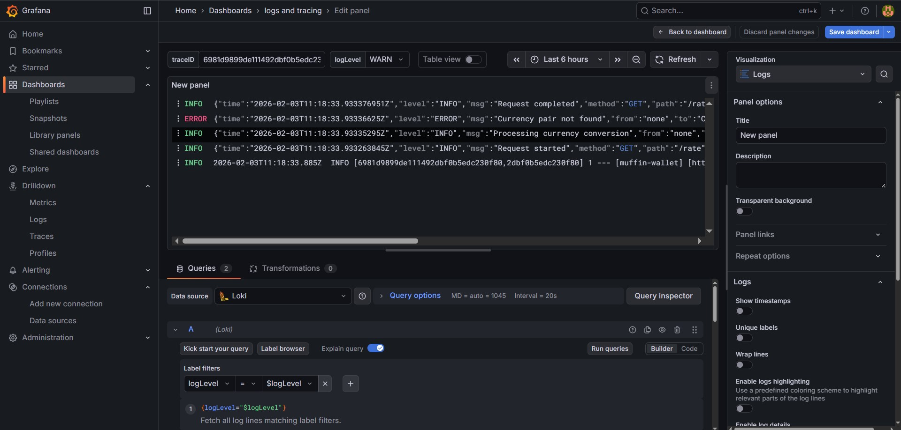
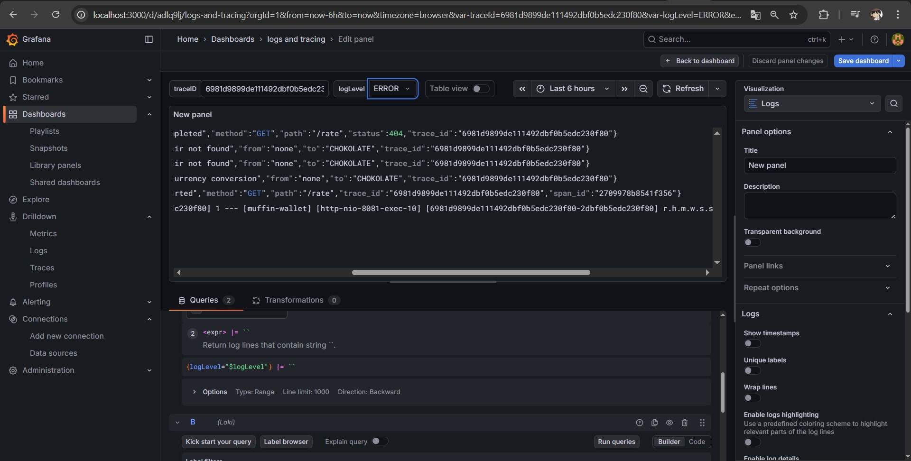
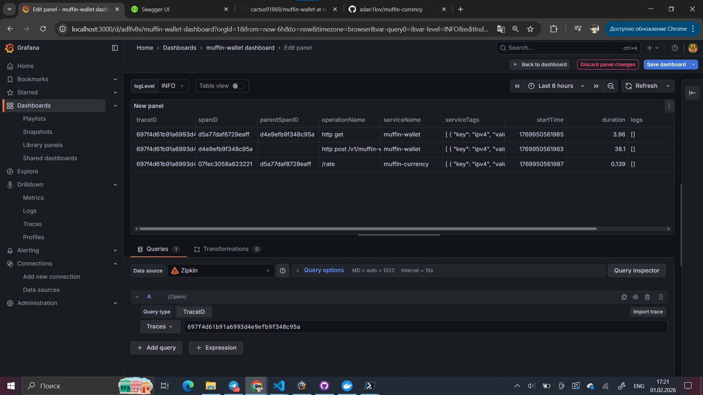

# Muffin wallet

- [x] Разверните приложение muffin-wallet внутри кластера Kubernetes (minikube), используя манифесты Kubernetes или Helm-chart.
- [x] Разверните приложение muffin-currency внутри кластера Kubernetes (minikube), используя манифесты Kubernetes или Helm-chart.
- [x] Обеспечьте сбор логов из приложения muffin-wallet. 
- [x] Обеспечьте сбор трейсов системы. 

## Что было сделано:

1) развернуты в кубере grafana, loki, zipkin
2) развернута бд в докере
3) собраны новые images и опубликованы в докер хаб
4) развернуты muffin wallet, muffin currency с promtail sidecar
5) настроена графана с соединением с Локи и Зипкин
6) создан дэшборд с поиском по logLevel, traceId 

## Как запустить:

* Запустить minikube. minikube start
* Запустить докер компоуз из директории "/local-env/helm". docker compose up -d 
* Зайти в директорий local-env/helm запустить командой helmfile sync или helmfile apply.
* Проверить, что запустились все поды в неймспейсах: muffin и monitoring
* Сделать порт форвард для графаны, чтобы затем ее открыть через localhost. kubectl port-forward -n monitoring svc/grafana 3000:3000
* Зайти в Grafana (login: admin, password: admin) и там создать дэшборд (соединения прописаны в yaml файлах графаны) 

Сортировка по labelId, logLevel 

Лейблы из зипкина
